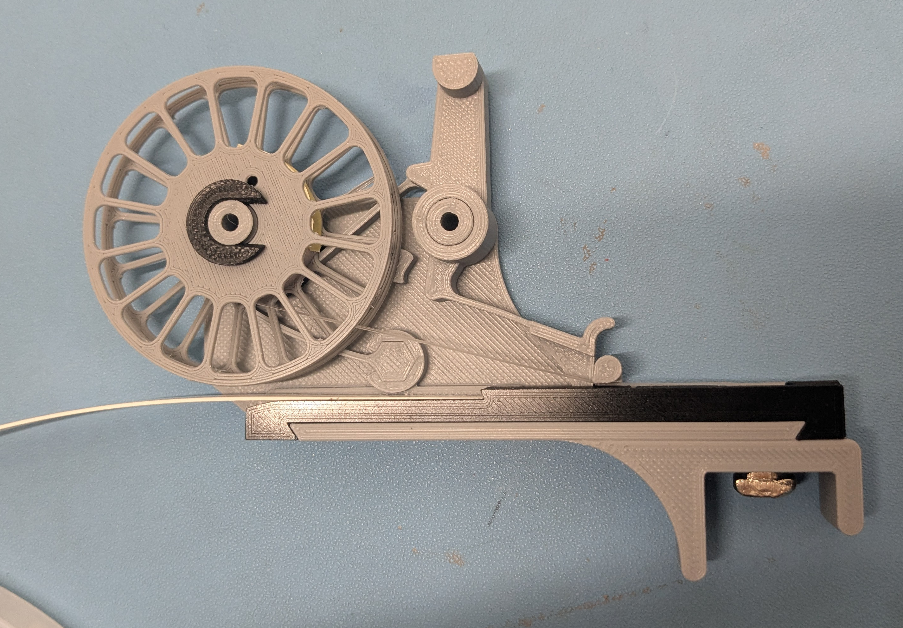
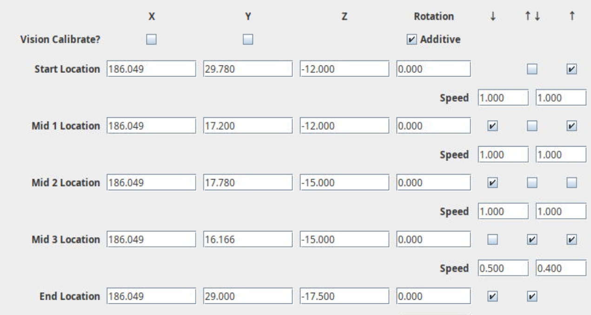
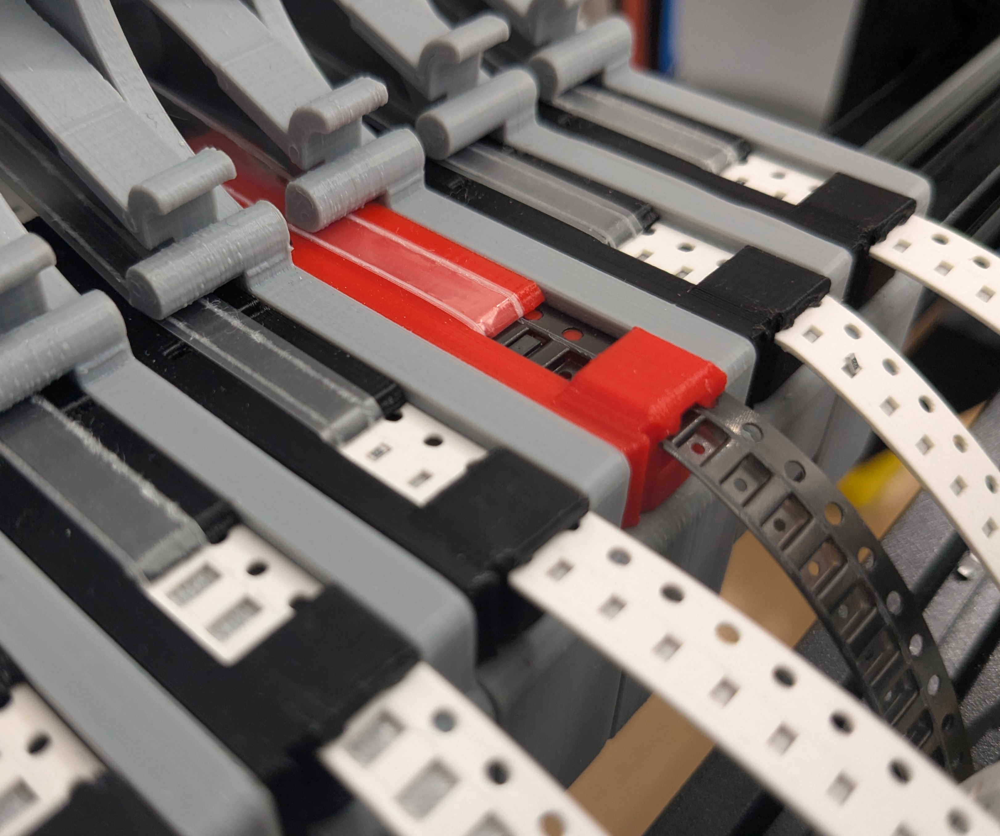
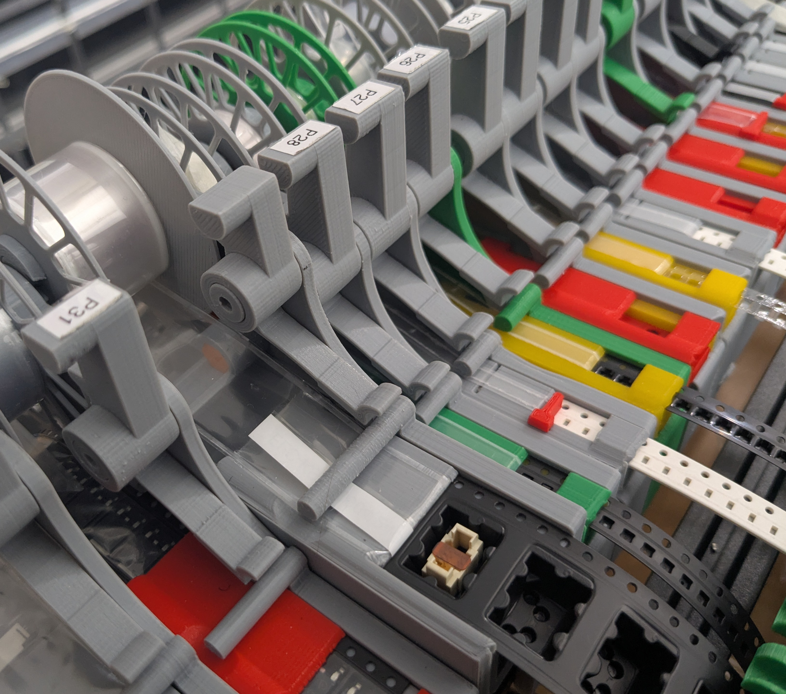
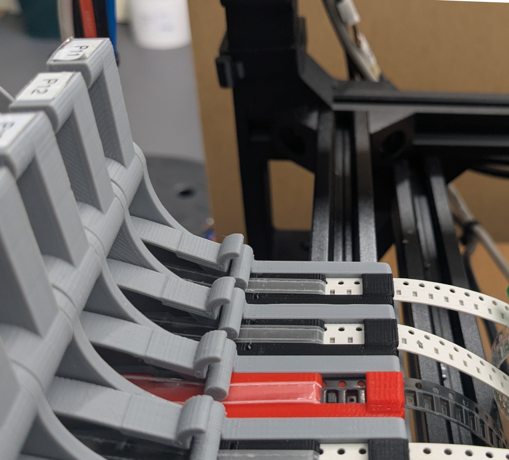
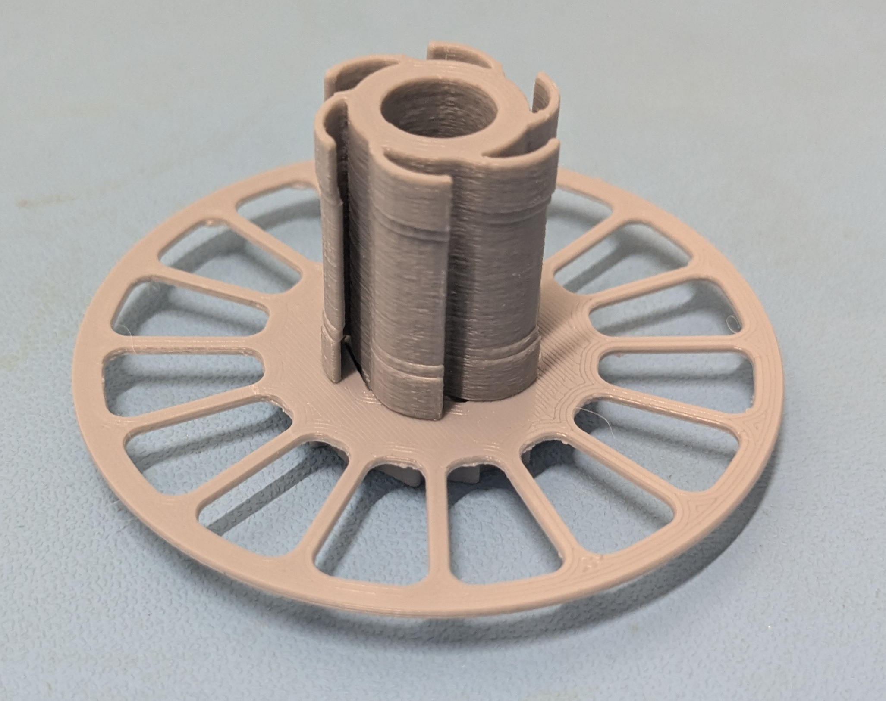
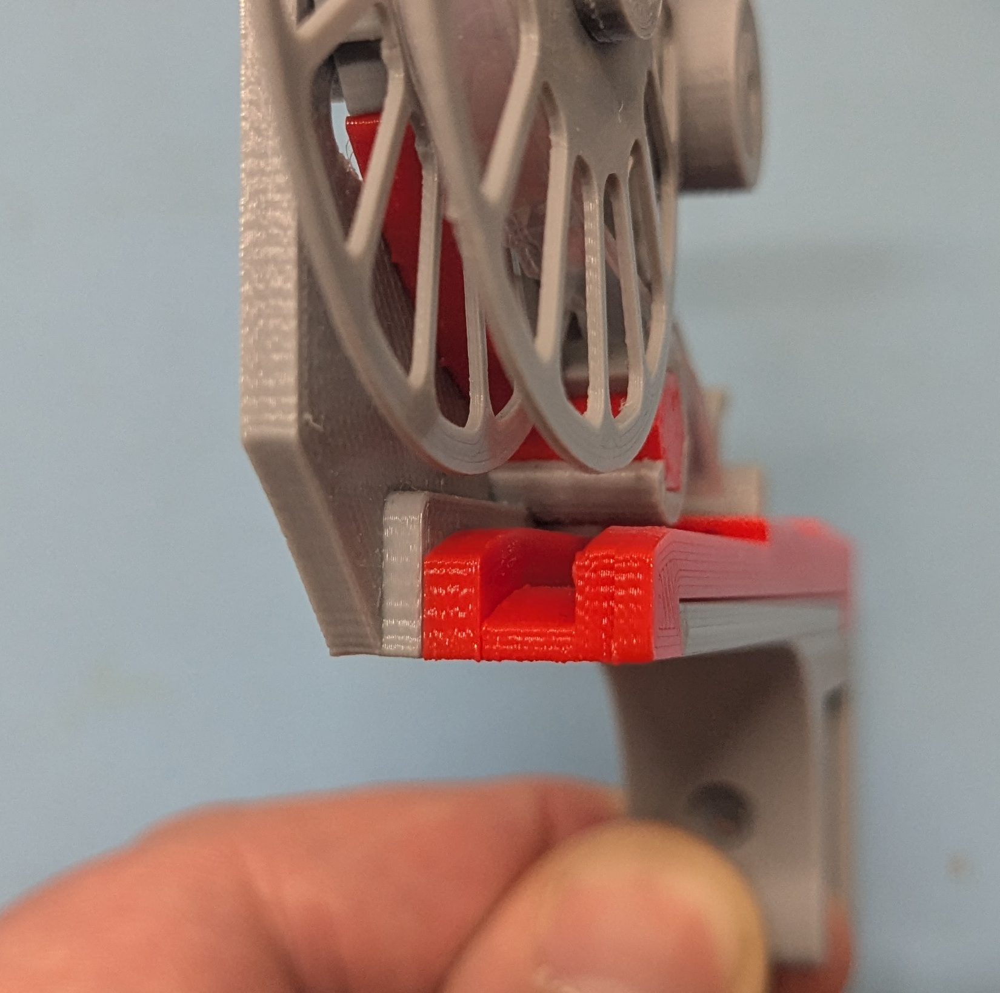

# PushPullFeeder
All 3d-Printed Feeder

This is a fork of Markmaker’s awesome [PushPullFeeder](https://github.com/markmaker/PushPullFeeder). All of the genius in this design should be credited to Mark, and Marks's [blog](https://makr.zone/?p=399) is a great introduction. Here I present some refinements:

- Some general usability and maintainability improvements.
- Some incremental improvements for feeding parts which were already handled well in Mark’s baseline design.
- Some new features for feeding parts which were outside the scope of Mark’s original design: Parts with deep wide embossed pockets; from 8mm tape with 4mm pockets, up to 24mm with 11mm pockets tested to be working well.
- An alternative machine mounting scheme which is particularly suitable for the lumenpnp machine. This model still supports Mark's mounting scheme too.

The original model supports a dazzling array of configuration parameters. Here I present some useful parameter sets that I use in production on the lumenpnp.

# Changed Features

## Improvements for parts in paper tape
- The "inset" is the part which holds the tape as it passes through the feeder. There are several changes to the profile of the inset to reduce part jumpiness. Firstly, this model grips the tape all around the pick window, to firmly hold the tape and minimise the risk that vibrations cause a part to jump.
- The grip after the pick window is arched to allow any mispicked parts to be expelled out the front of the feeder.
- One of the final actions during the push/pull feed cycle is that the reverse-blocking tooth engages with the sprocket holes. This has been seen to cause jumpiness in very lightweight parts. A new slot in the inset acts to decouple these vibrations. This slot is located between the reverse-blocking tooth and the pick area.

## Improvements for parts in embossed plastic tape
- Add a second reverse-blocking tooth to minimise the possibility of it not engaging with very thin plastic tape.
- An option to print the inset in two halves. The left half supports under the sprocket holes on the left side of the tap. The right half supports under the right side of the tape, and grips the tape from above. This avoids any geometry limitations due to 3d printer overhang angle, and allows insets for tapes with deep and wide embossed pockets. This also allows a tighter prestressed grip on the tape to reduce jumpiness.

## Improvements for cover film peeling
- The film peeling edge has been remodelled to ensure it is perpendicular to the tape feed direction, which reduces the risk of the film tearing.
- A narrower mount for the reverse-blocking spring gives a clearer path for film onto the peeling spool.
- With wider tapes, the friction wheel sometimes had a problem where there is an excess of friction due to a large contact area, and the peeling force is too large. The film can pull the tape ahead of the sprocket hole engagement. A tapered friction wheel controls the contact area used with wider tapes.
- “The scraper” is a new optional feature which can be used for feeding parts that tend to stick to the film rather than stay in their pocket. This is a finger which holds the parts in their pocket until they advace to the pick location.

## Changes to the lever
- Mark's original design horizontally scaled the lever and various other design features in proportion to the tape width. That scheme has been changed to have a fixed width lever. I think this makes more sense; tapes of all widths are advanced using sprocket holes of the same dimensions. Furthermore this reduces the number of different parts that need to printed.
- There are some geometry changes to give more space around any part that might be carried by the other nozzle on a dual-nozzle machine. Firstly, the angle of the lever arm has been changed to be exactly vertical. This increases the X/Y space available for the part on the other nozzle.
- Secondly, the knob at the top of the lever arm has a flatter profile. This increases the Z space available for the part on the other nozzle.

## Usability and Printability improvements
- Added some fillets in places which previously saw some brittle fractures.
- Sometimes the inset can be a tight fit on the base, so some features have been added to aid disassembly. Finger grips for pulling it off, and a second hole through the base for pushing it off.
- Improved retention of the film peeler spool washer, or reel-holder arm counterpart.

## A new optional machine mount.
Use with the lumenpnp has several design requirements that are quite different to Mark’s baseline design.

- The lumenpnp head has a large Y offset between nozzles and camera which makes it impractical to use the camera with the PushPull feeder. Since we can’t use the camera to fine-tune the pick location, we benefit from the pick location being very stable and repeatable. The feeder is therefore mounted onto a 20mm extrusion directly underneath the pick location. This new 20mm extrusion is mounted to the machine side rails using 2 angle brackets at each end for rigidity. See photos below.
- The feeder is mounted onto the extrusion using a 6mm M3 countersunk screw and t-nut, directly underneath the pick location. The screw is captive in the feeder once the inset is fitted, and the screw can be driven through a hole in the base of the inset so that it can be fitted and removed while tape is loaded on the feeder; you just need to cut off the empty tape end, and retract the tape a little to expose the hole.
- There is a separate git repository for a [lumenpnp z gantry](https://github.com/tobydickenson/PushPullGantry) modification which includes the hook needed for pushing and pulling the feeder lever.

## Extra-deep feeders
- This includes a configuration for a feeder for parts up to 11mm tall in 16mm or 24mm tape. This feeder has a deeper base and deeper inset to support the deep tape.
- A correspondingly shorter lever is used to maintain a safe-z height consistent with the normal feeders. This needs a slightly slower push/pull speed.

# How to Print

STL files for immediate printing are in the `printme` directory.

Mark recommends printing all parts in PETG.
PETG is a good choice. I have also had success with PLA, for all parts except those with thinned springs because PLA elastic modulus is affected by room temperature.

IMPORTANT: Before printing, it is critical that your printer can produce dimensionally accurate parts. Print the `printme/nuts/nuts-zero-5.stl` file, and confirm that:

- The parts are circular
- Inner and outer diameter of the parts are 8.00mm
- The part mate, and work as an axel
- The axle turns evenly through 360°. If your printer leaves a line of layer start/end points then a "randomize start location" slicer option may make it turn more evenly.

Any problems need to be addressed first, through either printer hardware maintenance or slicer configuration. The printed feeder is very sensitive to dimensional tolerance; if your printer can't produce an accurate nut then it will not be able to print a working feeder!

# Recommended Movement Steps

The movement steps described below are a little different to those described in Mark’s setup video. The key difference is that the start location is in front of the feeder, not above. This means that the programmed push/pull motion takes the hook actuator well away from the feeder, and therefore the push/pull mechanism does not need to be considered when configuring safe-z.

Manually move the feeder’s push/lull lever back to its home position, with the “dog” pusher fully forward against the end stop.

- Set the **Start** location with the tip of the the hook 1mm above the lever, and 10mm in front.
- **Mid1** location should be set with the hook 1mm above the lever, and aligned ready to move down. Note that the “heel” of the hook ensures that the lever is returned back into its home position during the movement to this location.
- **Mid2** location: The hook moves down 3mm and forward 0.5mm. This engages the hook onto the lever.
- **Mid3** location: This is the position with the hook under tension pulling back, pushing the tape forward. Set this position to the same Z as Mid2, and 1.5mm back. You may need to adjust the 1.5mm offset; it needs to push the tape all the way forwards (for repeatable positioning) without unduly bending the lever arm.
- **End** location: This is the position with the hook under tension pushing forward. Relative to Mid 2 this is 10mm forward and 2.5mm down. 10mm is a good starting point, but you might find this needs to be increased up to around 12mm, depending on machine rigidity.

The tickboxes control which locations are visited for the forward and backward stroke, and which locations are repeated when pumping multiple cycles in one visit. As shown below, Mid3 is skipped on the forward cycle, Mid 2 skipped on the backwards cycle, and only Mid3 and End are repeated for multiple cycles.

# BOM

To print a complete feeder you will need one item for each of the following categories. STL files are in the `printme` folder for direct printing:

- A base. 8mm, 12mm, or 16mm wide bases support paper tape and plastic tape with pockets up to 4mm deep. A 24mm extra-deep base supports both 24mm and 16mm tapes, with up to 11mm pockets.
- A lever. The normal size fits the normal bases, and the extra-deep base needs a shorter lever.
- A blocking spring; a single size for all feeders
- For the film-peeling spool, the left side has an option to print either as a solid plate (for more robustness) or with spokes (for better visibility).
- The spool right side has 8mm, 12mm, 16mm, or 24mm options.
- The spool friction wheel again has width options. Please check out the README file in this directory if this prints poorly.
- A drum, which holds the peeled tape on the spool. Again this has width options.
- A washer; a single size.

Plus each feeder needs an inset. Insets for 8mm paper are printed as a single part. Options are:

- 8mm for thin 0.7mm paper tape.
- 8mm for thin paper with a scraper. (If you are not sure, then you don’t want a scraper)
- 8mm for thick 1.0mm paper tape.
- 8mm for thick paper with a scraper.

Insets for plastic tape are printed in two parts. Options for the left side are:

- The normal size which works with 8mm, 12mm, and 16mm feeders
- The extra-deep size for 24mm bases.

Options for the plastic tape right side are:

- 8mm
- 8mm with a scraper
- 12mm
- 12mm with a scraper
- 16mm
- 16mm extra-deep
- 24mm extra-deep

# Photos!

Some feeders mounted on the machine. Here we have 4 feeders for 8mm thin paper tapes (with the black inset) and one 8mm feeder for embossed plastic tape (inset in red).

Below, the 24mm feeder with extra-deep pockets is feeding a connector. Note the extra-deep feeder has an extra-short lever to keep a consistent hook engagement height.

Feeder P27 with an inset for 8mm paper tape has the "scraper" option. The scraper is the red finger which holds the parts in their pocket if they have a tendency to stick to the film.

All the other feeders here have insets for plastic tape.

This shows the feeders mounted onto the 20mm extrusion, and that extrusion mounted onto the side rails of the lumenpnp machine. This is the recommended location on a lumenpnp; it puts the feeder right at the front of the machine. The hook can only just reach the lever, and the nozzles only just reach the parts at the pick location, so there is minimal waste of build area on the rest of the machine.

Partial assembly of the friction wheel onto the left side of the spool.

The scraper finger removed from the inset.

The red inset on the left illustrates the two-part assembly of plastic tape insets; the left part of the inset is in yellow, and the right in red. This also shows the access hole for tightening the 3M bolt into the t-nut.

The inset for plastic tape with embossed pockets is printed in two parts, which allows those embossed pockets to be deep and wide without requiring 3d printer overhang.

