# PushPullFeeder

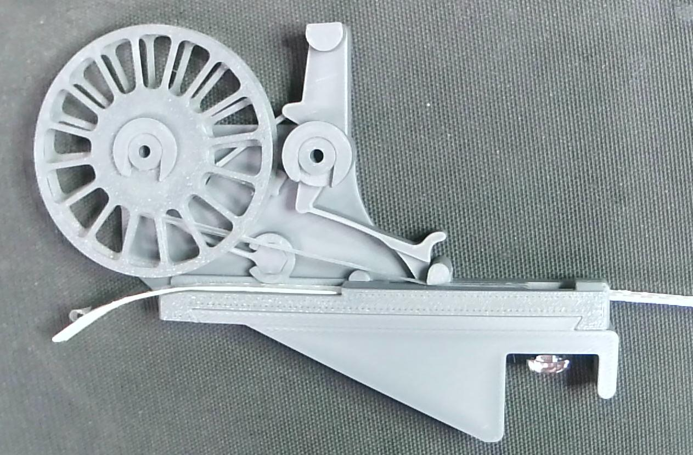

This is a fork of Markmaker’s awesome [PushPullFeeder](https://github.com/markmaker/PushPullFeeder). All of the genius in this design should be credited to Mark, and Mark's [blog](https://makr.zone/?p=399) is a great introduction. Here I present some refinements:

- Some general usability and maintainability improvements.
- A new Bumper Cam mechanism for engaging and disengaging the pushing mechanism with the sprocket hole which greatly improves smoothness.
- Some incremental improvements for feeding parts which were already handled well in Mark’s baseline design.
- Some new features for feeding parts which were outside the scope of Mark’s original design: Parts with deep wide embossed pockets; from 8mm tape with 4mm pockets, up to 24mm with 11mm pockets tested to be working well.
- An alternative machine mounting scheme which is particularly suitable for the lumenpnp machine. This model still supports Mark's mounting scheme too.

The original model supports a dazzling array of configuration parameters. Here I present some useful parameter sets that I use in production on the lumenpnp.

# Changes in Release 176 (March 2026)

- Printability improvements for Bambu printers - My main printer is now A1 mini.
- A huge increase in smoothness. Previous versions push the tape with a pair of sprung teeth. In previous versions a tooth on the pusher dog drags along the top surface of the tape then drops into a sprocket hole before pushing forward. The tape is then pushed over the reverse-blocking tooth, which pops into the sprocket hole at the end of the push. All of these actions cause vibrations and impacts on the tape surface which can cause vibrations which jump 0603 and smaller parts out of pockets. This version uses "the bumper" cam which actively lifts the tooth out of one sprocket hole, and lowers into the next before pushing forward. The reverse-blocking tooth is removed entirely. Having eliminated the main causes of vibrations, it has been possible to eliminate some other vibration-mitigation features which further improves the smoothness of the feed.
- The lever part is much more robust. This is due to some design refinements and some changes to the printing recommendations.
- A compliant spring mechanism to gently support the underside of the tape and hold its top surface at the correct Z position.
- An improved friction clutch for film peeling.
- Further improvement to prevent the tape getting jammed. A jammed tape can cause the lever to break when activated.
- Improved rigidity on the machine mount.
- Some changes to recommended printer settings - see below.
- Change to assist in assembling the film peeling spool onto the base.

## Changes since the first alpha release of this branch

- Increased peeling force.
- Changes to the compliant spring and base to accomodate super-thin and super-fat tapes.
- Move the paper tape pick window for better alignment with 0402 parts.
- Fix a chamfer on the lever axle hole.
- Change some through holes to blind holes for a cleaner faster bottom surface print.

# Changes in Release 74 (August 2025) excluding those later reverted in Release 176

## Improvements for parts in paper tape
- The "inset" is the part which holds the tape as it passes through the feeder. There are several changes to the profile of the inset to reduce part jumpiness.
- The grip after the pick window is arched to allow any mispicked parts to be expelled out the front of the feeder.
- A gentle lead-in to help insert the tape into the back of the inset.

## Improvements for parts in embossed plastic tape
- An option to print the inset in two halves. The left half supports under the sprocket holes on the left side of the tap. The right half supports under the right side of the tape, and grips the tape from above. This avoids any geometry limitations due to 3d printer overhang angle, and allows insets for tapes with deep and wide embossed pockets.

## Improvements for cover film peeling
- The film peeling edge has been remodelled to ensure it is perpendicular to the tape feed direction, which reduces the risk of the film tearing.
- A narrower mount for the peeling spring gives a clearer path for film onto the peeling spool.
- With wider tapes, the friction wheel sometimes had a problem where there is an excess of friction due to a large contact area, and the peeling force is too large. The film can pull the tape ahead of the sprocket hole engagement. A tapered friction wheel controls the contact area used with wider tapes.
- “The scraper” is a new optional feature which can be used for feeding parts that tend to stick to the film rather than stay in their pocket. This is a finger which holds the parts in their pocket until they advace to the pick location.

## Changes to the lever
- Mark's original design horizontally scaled the lever and various other design features in proportion to the tape width. That scheme has been changed to have a fixed width lever. I think this makes more sense; tapes of all widths are advanced using sprocket holes of the same dimensions. Furthermore this reduces the number of different parts that need to printed.
- There are some geometry changes to give more space around any part that might be carried by the other nozzle on a dual-nozzle machine. Firstly, the angle of the lever arm has been changed to be exactly vertical. This increases the X/Y space available for the part on the other nozzle.
- Secondly, the knob at the top of the lever arm has a flatter profile. This increases the Z space available for the part on the other nozzle.

## Usability and printability improvements
- Added some fillets in places which previously saw some brittle fractures.
- Sometimes the inset can be a tight fit on the base, so some features have been added to aid disassembly. Finger grips for pulling it off, and a second hole through the base for pushing it off.
- Improved retention of the film peeler spool washer, or reel-holder arm counterpart.

## A new optional machine mount.
Use with the lumenpnp has several design requirements that are quite different to Mark’s baseline design.

- The lumenpnp head has a large Y offset between nozzles and camera which makes it impractical to use the camera with the PushPull feeder. Since we can’t use the camera to fine-tune the pick location, we benefit from the pick location being very stable and repeatable. The feeder is therefore mounted onto a 20mm extrusion directly underneath the pick location. This new 20mm extrusion is mounted to the machine side rails using 2 angle brackets at each end for rigidity. See photos below.
- The feeder is mounted onto the extrusion using a 6mm M3 countersunk screw and t-nut, directly underneath the pick location. The screw is captive in the feeder once the inset is fitted, and the screw can be driven through a hole in the base of the inset so that it can be fitted and removed while tape is loaded on the feeder; you just need to cut off the empty tape end, and retract the tape a little to expose the hole.
- There is a separate git repository for a [lumenpnp z gantry](https://github.com/tobydickenson/PushPullGantry) modification which includes the hook needed for pushing and pulling the feeder lever.

## Extra-deep feeders
- This includes a configuration for a feeder for parts up to 11mm tall in 16mm or 24mm tape. This feeder has a deeper base and deeper inset to support the deep tape.
- A correspondingly shorter lever is used to maintain a safe-z height consistent with the normal feeders. This needs a slightly slower push/pull speed.

# How to print

STL files for immediate printing are in the `printme` directory.

All parts should be printed in PETG. PETG has a stable modulus over temperature, which is required for the spring parts. PETG has good abrasion resistance, which is required for the lever and base which interact at "the bumper".

All models are tested on a Bambu printer with 0.4mm nozzle. All parts print with the standard "0.12mm High Quality" print profile, with the exception of the Lever part (see below)

For other slicers, use a "layer start: sharpest corner" or "seam: aligned" option. Plain bearing surfaces have a helical groove which is designed to capture the layer start, ensuring that the exposed bearing surface is a smooth continous extrusion.

IMPORTANT: Before printing, it is critical that your printer can produce dimensionally accurate parts. Print the `printme/nuts/nuts-xxx.stl` file, and perform the following checks:

- Check the bottom surface (first layer) is smooth and correct. A textured build plate is ok.
- Check the top surface is smooth and correct. It is ok to have some under-extrusion visible in the top surface, and indeed this is better than a precise flow calibration which shows a smooth top surface but makes surface dimensions more sensitive to any variation in flow.
- Check the parts are circular, not elliptical.
- Check the parts are circular, not a lower polygon count approximation substituted by your slicer.
- Check the outer diameter of the male part is 8.00mm, and its surface is smooth. This is a dimension accuracy check.
- Check the inner diameter of the female part printed with "10" is 8.10mm. This is labelled 10 because of the 10x10µm size increase. Fitting the male part inside this hole is a validation check of axle plain bearings. The axle should turn smoothly, without being loose. See the assembly video (linked below) for how this axle should appear.
- Check the inner diameter of the other female part printed with "0" is 8.00mm. Fitting the male part inside this hole is a validation of interference fit assembly.

Any problems need to be addressed first, through either printer hardware maintenance or slicer configuration. The printed feeder is very sensitive to dimensional tolerance; if your printer can't produce an accurate nut then it will not be able to print a working feeder!

If any of the diameters are wrong then you will need to adjust a "X-Y hole compensation" slicer option with a correction offset. Re-print the test nuts and re-check.

The **Lever** parts has a leaf spring feature which needs a modified slicer profile. The important constraint is that the leaf springs must be printed as continuous extrusions; any discontinuities will result in a stress concentration which will make the spring insufficiently robust. On a Bambu printer with 0.4mm nozzle this can be acheived by setting the "Outer wall" and "Inner wall" options to **0.3mm**. Please confirm this has the desired effect using your slicer preview. The leaf springs should be printed as four wall extrusions with no discontinuities, as highlighted in green below. The red highlights show various discontinuities which would cause the leaf spring to be insufficiently robust (although they will still probably feed several thousand parts before breaking with fatigue, so dont panic if this is difficult to get right on your first print).

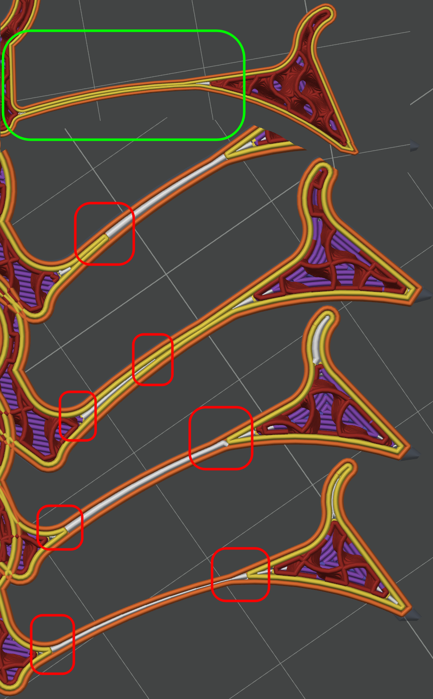

# Recommended movement steps

The movement steps described below are a little different to those described in Mark’s setup video. The key difference is that the start location is in front of the feeder, not above. This means that the programmed push/pull motion takes the hook actuator well away from the feeder, and therefore the push/pull mechanism does not need to be considered when configuring safe-z.

Manually move the feeder’s push/lull lever back to its home position, with the “dog” pusher fully forward against the end stop.

- Set the **Start** location with the tip of the the hook 1mm above the lever, and 10mm in front.
- **Mid1** location should be set with the hook 1mm above the lever, and aligned ready to move down. Note that the “heel” of the hook ensures that the lever is returned back into its home position during the movement to this location.
- **Mid2** location: The hook moves down 3mm and forward 0.5mm. This engages the hook onto the lever.
- **Mid3** location: This is the position with the hook under tension pulling back, pushing the tape forward. Set this position to the same Z as Mid2, and 1.5mm back. You may need to adjust the 1.5mm offset; it needs to push the tape all the way forwards (for repeatable positioning) without unduly bending the lever arm. Set 20ms pause time to ensure the actuator remains momentarily stationary at this end point.
- **End** location: This is the position with the hook under tension pushing forward. Relative to Mid 2 this is 10mm forward and 2.5mm down. 10mm is a good starting point, but you might find this needs to be increased up to around 12mm, depending on machine rigidity. Set 20ms pause time to allow the dog to drop of the top of the bumper cam.

The tickboxes control which locations are visited for the forward and backward stroke, and which locations are repeated when pumping multiple cycles in one visit. As shown below, Mid3 is skipped on the forward cycle, Mid 2 skipped on the backwards cycle, and only Mid3 and End are repeated for multiple cycles.

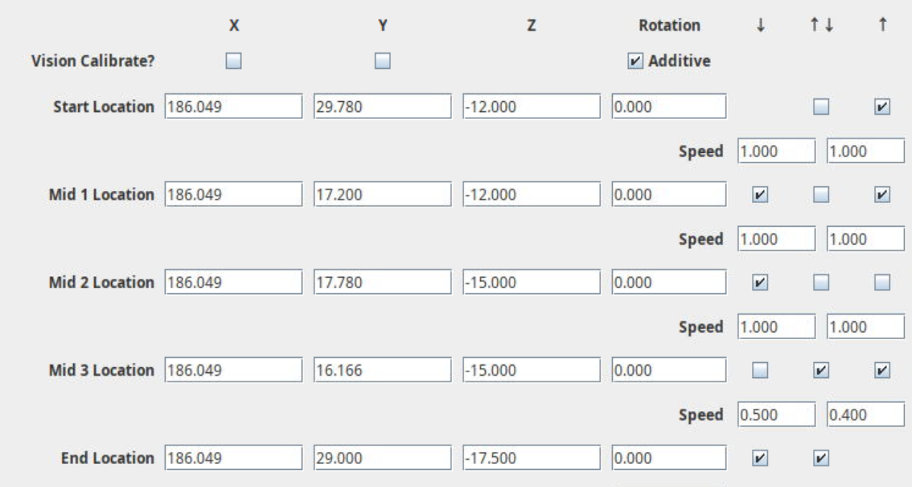

# BOM

Feeder options are:
 * Tape width
 * For 8mm tape, paper and plastic tape have different insets
 * For 8mm and 12mm feeders there is a on option to include the "scraper".
 * The 24mm feeder supports deeper pockets. There is an option to convert a 24mm extra-deep feeder for 16mm tape.

STL files are in the `printme` folder for direct printing.

|               |     |     |     |     |      |      |      |      |      |
| ------------- | --- | --- | --- | --- | ---- | ---- | ---- | ---- | ---- |
| **Options**   |     |     |     |     |      |      |      |      |      |
| Tape width    | 8mm | 8mm | 8mm | 8mm | 12mm | 12mm | 16mm | 16mm | 24mm |
| Paper tape?                         | yes |     | yes |     |      |      |      |      |      |
| Plastic tape?                       |     | yes |     | yes | yes  | yes  | yes  | yes  | yes  |
| Max embossed pocket depth           | 3mm | 3mm | 3mm | 3mm | 3mm  | 3mm  | 3mm  | 11mm | 11mm |
| Has a scraper?                      |     |     | yes | yes |      | yes  |      |      |      |
|                                     |     |     |     |     |      |      |      |      |      |
| **Printed Parts**                   |     |     |     |     |      |      |      |      |      |
| base-8mm                            | *   | *   | *   | *   |      |      |      |      |      |
| base-12mm                           |     |     |     |     | *    | *    |      |      |      |
| base-16mm                           |     |     |     |     |      |      | *    |      |      |
| base-24mm-extra-deep                |     |     |     |     |      |      |      | *    | *    |
|                                     |     |     |     |     |      |      |      |      |      |
| inset-8mm-left                      | *   |     | *   |     |      |      |      |      |      |
| inset-8mm-right                     | *   |     |     |     |      |      |      |      |      |
| inset-8mm-right-scraper             |     |     | *   |     |      |      |      |      |      |
| inset-8mm-12mm-16mm-plastic-left    |     | *   |     | *   | *    | *    | *    |      |      |
| inset-8mm-plastic-right             |     | *   |     |     |      |      |      |      |      |
| inset-8mm-plastic-right-scraper     |     | *   |     | *   |      |      |      |      |      |
| inset-12mm-plastic-right            |     |     |     |     | *    |      |      |      |      |
| inset-12mm-plastic-right-scraper    |     |     |     |     |      | *    |      |      |      |
| inset-16mm-plastic-right            |     |     |     |     |      |      | *    |      |      |
| inset-24mm-extra-deep-left          |     |     |     |     |      |      |      | *    | *    |
| inset-16mm-extra-deep-right         |     |     |     |     |      |      |      | *    |      |
| inset-24mm-extra-deep-right         |     |     |     |     |      |      |      |      | *    |
|                                     |     |     |     |     |      |      |      |      |      |
| lever-8mm-12mm-16mm                 | *   | *   | *   | *   | *    | *    | *    |      |      |
| lever-extra-deep                    |     |     |     |     |      |      |      | *    | *    |
|                                     |     |     |     |     |      |      |      |      |      |
| scraper-8mm                         |     |     | *   | *   |      |      |      |      |      |
| scraper-12mm                        |     |     |     |     |      | *    |      |      |      |
|                                     |     |     |     |     |      |      |      |      |      |
| friction-8mm                        | *   | *   | *   | *   |      |      |      |      |      |
| friction-12mm                       |     |     |     |     | *    | *    |      |      |      |
| friction-16mm                       |     |     |     |     |      |      | *    | *    |      |
| friction-24mm                       |     |     |     |     |      |      |      |      | *    |
| spool-left                          | *   | *   | *   | *   | *    | *    | *    | *    | *    |
| spool-right-8mm                     | *   | *   | *   | *   |      |      |      |      |      |
| spool-right-12mm                    |     |     |     |     | *    | *    |      |      |      |
| spool-right-16mm                    |     |     |     |     |      |      | *    | *    |      |
| spool-right-24mm                    |     |     |     |     |      |      |      |      | *    |
|                                     |     |     |     |     |      |      |      |      |      |
| drum-8mm                            | *   | *   | *   | *   |      |      |      |      |      |
| drum-12mm                           |     |     |     |     | *    | *    |      |      |      |
| drum-16mm                           |     |     |     |     |      |      | *    | *    |      |
| drum-24mm                           |     |     |     |     |      |      |      |      | *    |
| washer                              | 2   | 2   | 2   | 2   | 2    | 2    | 2    | 2    | 2    |
| blocking-spring                     | *   | *   | *   | *   | *    | *    | *    | *    | *    |
|                                     |     |     |     |     |      |      |      |      |      |
| **Hardware**                        |     |     |     |     |      |      |      |      |      |
| 6mm M3 countersunk screw            |     |     |     |     |      |      |      |      |      |
| M3 t-nut                            |     |     |     |     |      |      |      |      |      |

# Photos!

NB some of these photos show release 74.

## 8mm Feeder Photo

Some 8mm feeders mounted on the machine. One has a scraper.

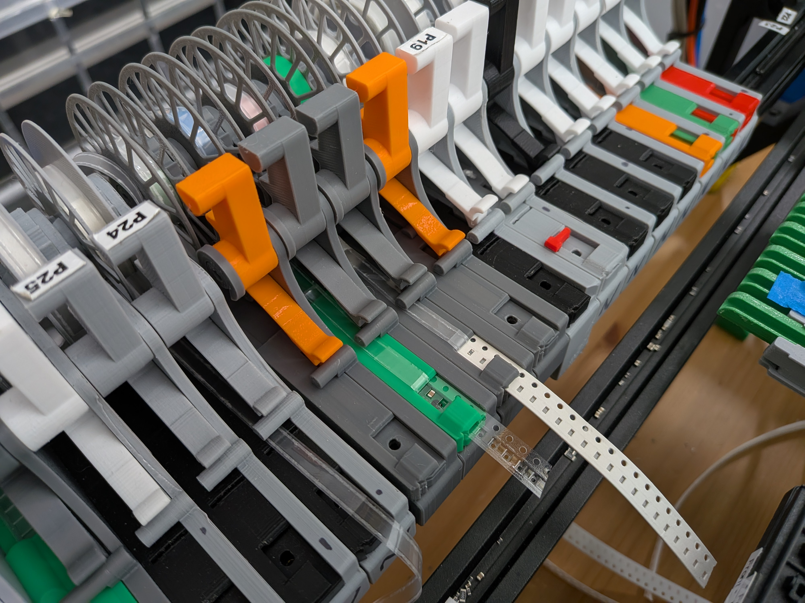

## 24mm Feeder Photo

A 24mm feeder with extra-deep pockets, and several 12mm feeders. Note the extra-deep feeder has an extra-short lever to keep a consistent hook engagement height.

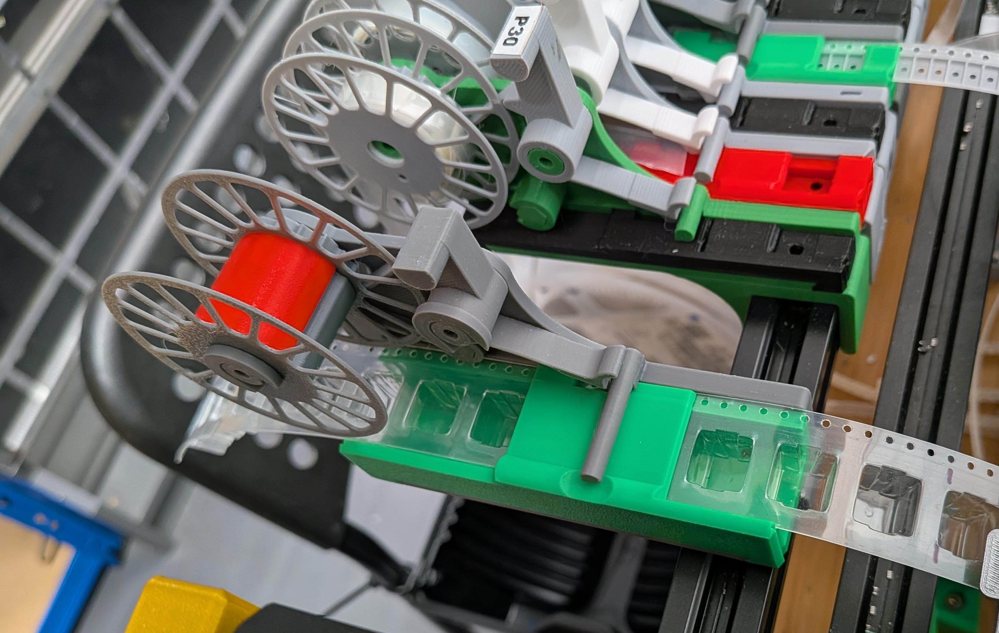

## Extrusion Photo

This shows the feeders mounted onto the 20mm extrusion, and that extrusion mounted onto the side rails of the lumenpnp machine.

This is my preferred location on a lumenpnp; it puts the feeder right at the front of the machine. The hook can only just reach the lever, and the nozzles only just reach the parts at the pick location, so there is minimal waste of build area on the rest of the machine.

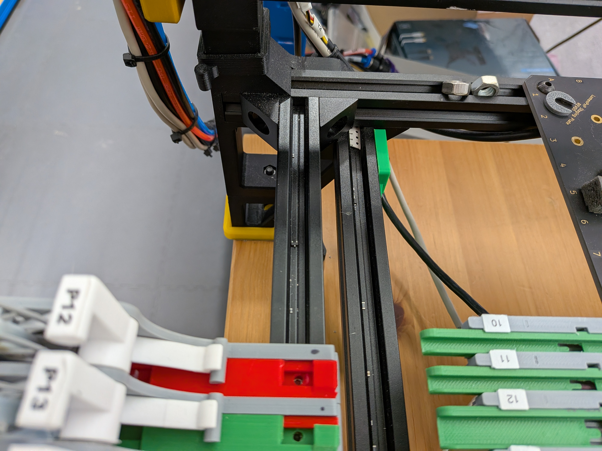

Alternatively the feeders extrusion could be stacked on top of the front rail. An advantage of this approach is that the feeder extrusion does not have to be the full width of the machine. (Please share if you have a photo of such a setup)

## Spool Photo

This is a 24mm spool. The red drum is to clamp the film.

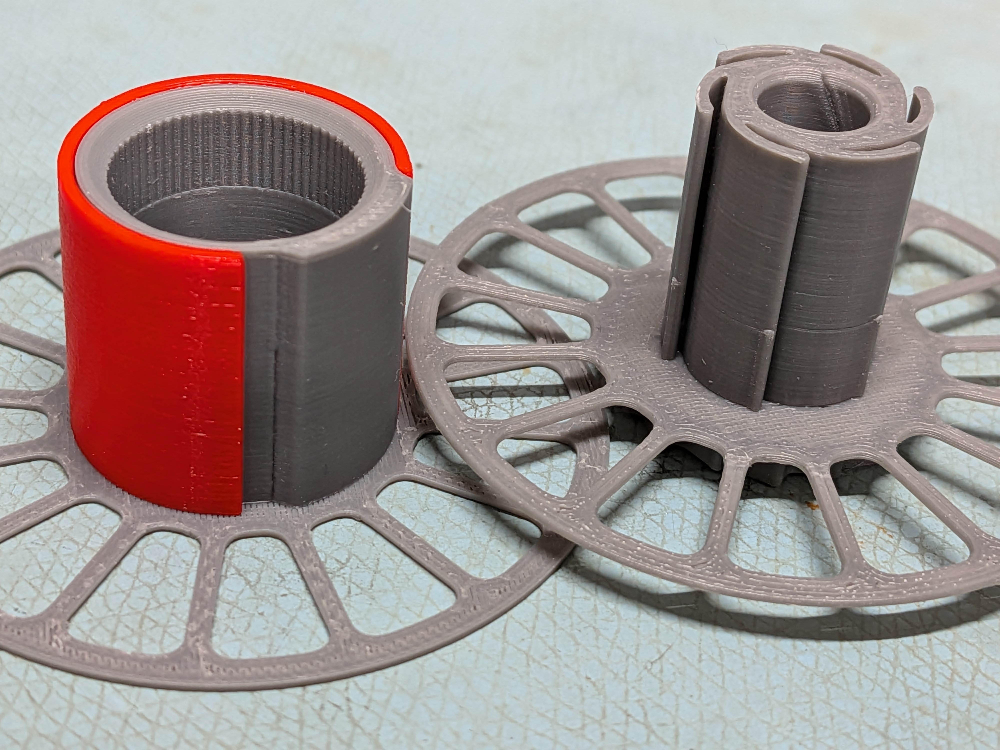

## Scraper Photo

The scraper finger removed from the inset. (The feeders in this photo are the previous version, release 74)

## Paper Inset Photo

The inset for paper tape is printed in two parts. The left part (green) is a compliant sprung platform that supports the full width of the tape, holds it at the right Z position, and accomodates tapes of different thicknesses.

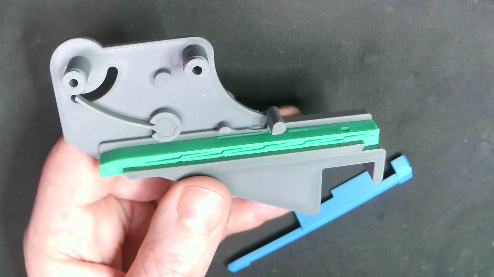

The right part (blue) of the inset for paper tape is the cover which defines the tape upper surface Z position. Here the feeder is fully assembled.

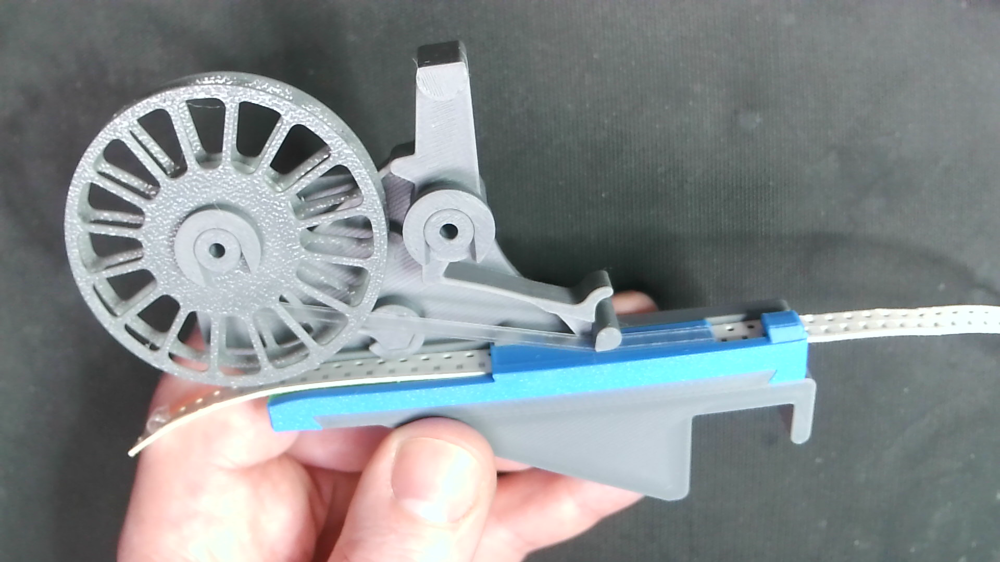

## Plastic Inset Photo

The inset for plastic tape with embossed pockets is also printed in two parts. The left part (green) is a compliant sprung platform that supports just the sprocket hole edge.

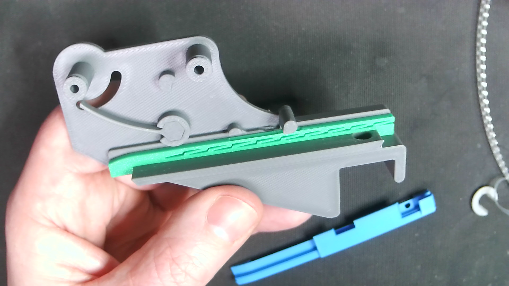

The right part (blue) hold the right edge of plastic tape. Here the feeder is fully assembled.

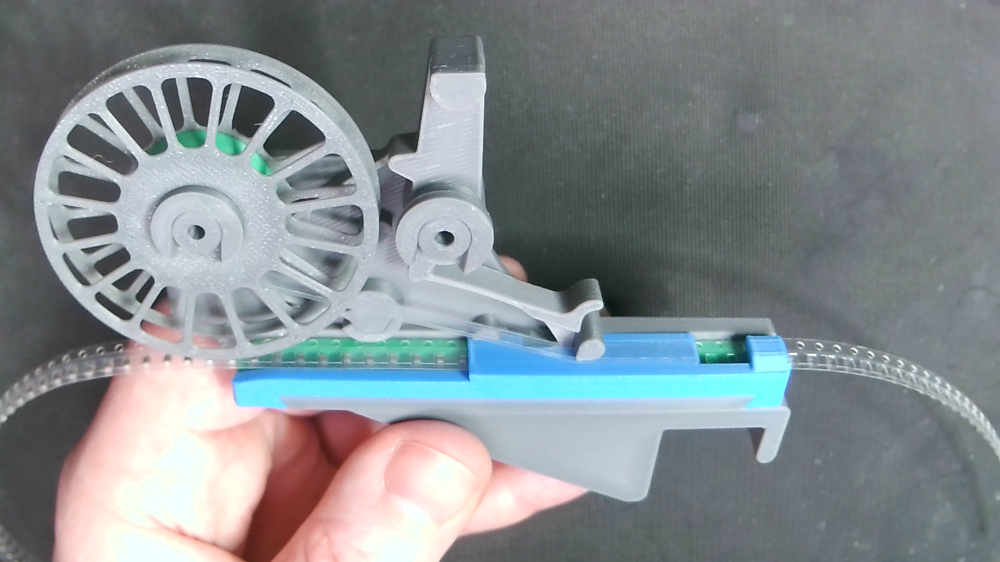

## Bumper Cam Photo

This shows the action of the bumper cam. It actively lifts the pusher tooth out of one sprocket hole, and lowers into the next before pushing forward.

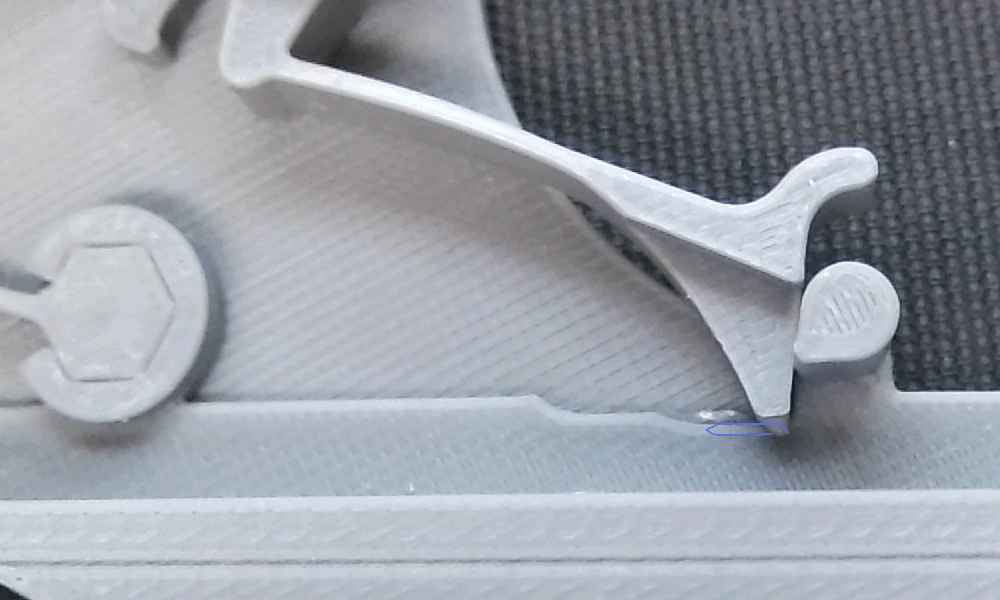

This is the profile of the bumper cam. When the pusher dog moves backward, it rides over the top of the cam (blue path)
which quickly withdraws the pusher thorn from the tape hole to avoid having it drag along the top surface of the tape.
When it pushes forward it rides to the right of the cam (green path) which lowers the pusher thorn into the hole
before pushing forward.

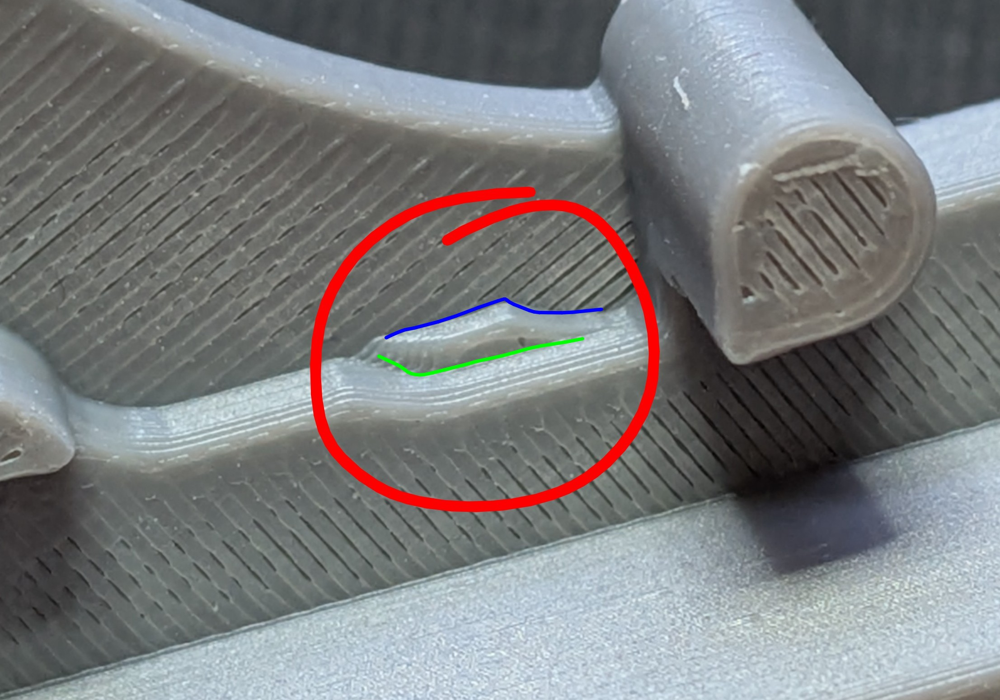

# Videos

The feeder in use, feeding and placing four parts. The feeders in this video are the previous version, release 74.

[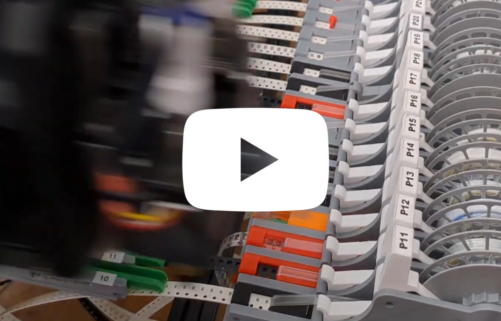](https://www.youtube.com/watch?v=HmRUPP_7lOk)

A single feed cycle, at 10% speed

[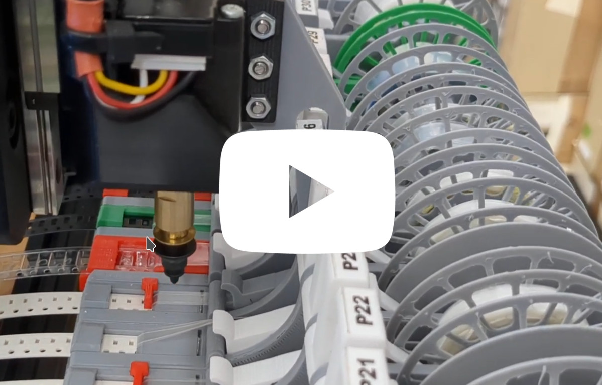](https://www.youtube.com/watch?v=0Pb1ezohiMo)

Assembly instructions

[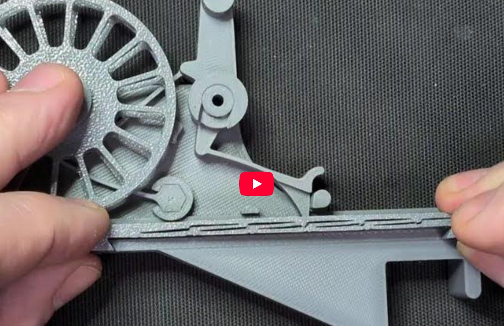](https://www.youtube.com/watch?v=XDT4DxTVX4w)

